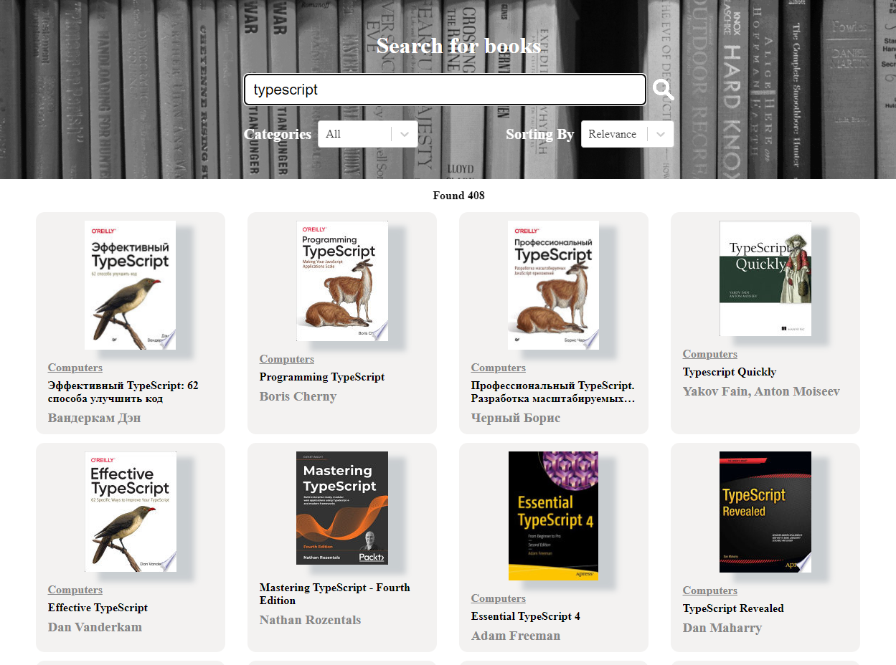

<h2 align="center"> Bookcase App </h2>

## [LiveDemo](#)

## Description

A simple book search SPA.
Created with Create React App

---

## Built With

* React.js
* TypeScript
* Redux Toolkit
* Styled Components
* Google Books API

---

## Installation and Setup Instructions

1. Installation and Setup Instructions
2. Installation: `npm install`
3. In the project directory, you can run: `npm start`

Runs the app in the development mode.
Open http://localhost:3000 to view it in the browser. The page will reload if you make edits.

